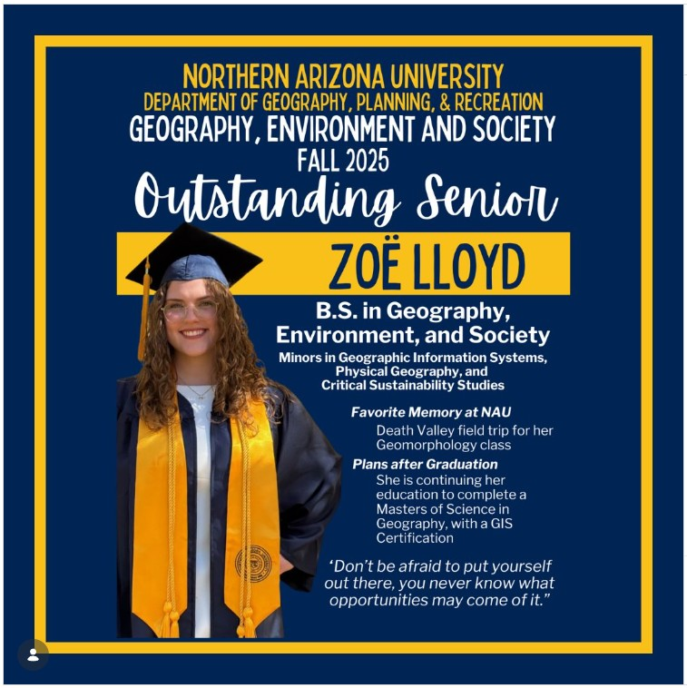
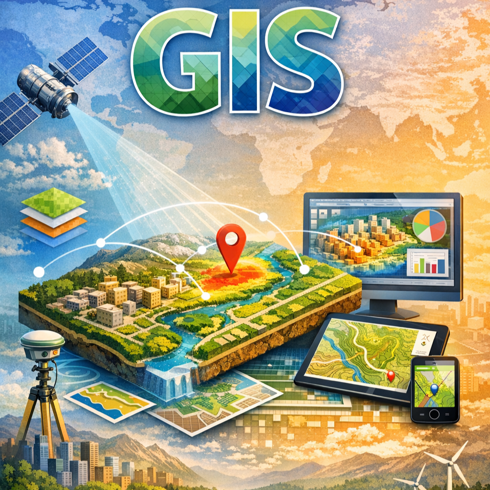
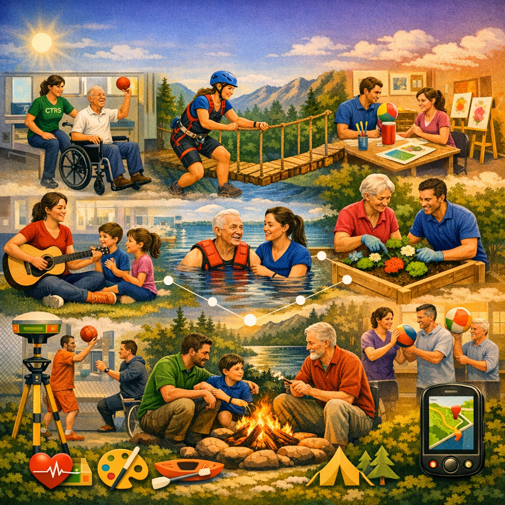

---
title: "Academic Programs | NAU Geography, Planning & Recreation"
summary: "Undergraduate and graduate degrees in geography, environment and society, geographic science and community planning, GIS and remote sensing, and career preparation programs."
date: 2026-03-03
type: landing

sections:
- block: hero
  content:
    title: |
      Academic Programs
    text: |
       
      The Department of Geography, Planning, and Recreation offers comprehensive degree and certificate programs designed to prepare students for careers in environmental and community sustainability, urban planning, parks and recreation management, and GIS technology. Discover your path to building better communities and buiding a better world.
    image:
      filename: la-field-trip1.jpg
- block: markdown
  content:
    title: "Explore Our Degrees"
    text: |
      Our degree programs provide hands-on learning experiences and prepare students for successful careers in environmental and society sustainability, community planning, park and recreation management, and GIS technology. From undergraduate foundations to advanced graduate research, find the program that matches your goals.
      
      

        

          
          <h4>Undergraduate Programs</h4>
          <ul>
            <li><strong>Geography, Environment and Society, BS</strong> - 120 units with general studies requirements</li>
            <li><strong>Geographic Science and Comunity Planning, BS</strong> - Coursework and one out of three emphasis areas.</li>
            <li><strong>Parks and recreation management, BS</strong> - Recognized by the National Recreation and Park Associatin (NRPA)</li>
          </ul>
          
<a href="undergraduate-degrees/" class="btn btn-primary">Learn More About Undergraduate Programs</a>

        

        

          
          <h4>Graduate Programs</h4>
          <ul>
            <li><strong>Geography, MS</strong> - Thesis and practicum options, flexible course and focus area options</li>
            <li><strong>GIS / Remote Sensing, MS</strong> - One-year, 12 credits fall, 12 credits spring, 6 credits summer</li>
            <!--<li><strong>Parks and recreation management, MS</strong> - Currently not accepting new applications</li>-->
            <li><strong>Sustainable communities, MA</strong> - Thesis project required to complete this program, an internship or field work required</li>
          </ul>
          
<a href="graduate-degrees/" class="btn btn-primary">Learn More About Graduate Programs</a>

        

      

  design:
    columns: 1
- block: markdown
  content:
    title: "Explore Our Certificate Programs"
    text: |
      Certificate programs provide specialized training for career advancement and skill development in high-demand areas. Choose from professional certificates, graduate certificates, or undergraduate certificates that complement your career goals.
      
      

        

          
          <h4>GIS with Remote Sensing Graduate Certificate</h4>
          
A post-graduate certificate that is well suited for students who want to enter the field of GIS or apply geospatial techniques and analysis to their desired discipline.

          <ul>
            <li>Online</li>
            <li>16 credits</li>
          </ul>
          
<a href="https://in.nau.edu/department-geography-planning-recreation/gis-certificate/" class="btn btn-primary">Learn More About this Graduate Certificate</a>

        

        

          
          <h4>Recreational therapy Graduate Certificate</h4>
          
Prepare future Recreational Therapists (RT) to meet the qualifications of the National Council for Therapeutic Recreation Certification (NCTRC) exam.

          <ul>
            <li>Online</li>
            <li>18 credits</li>
          </ul>
          
<a href="https://in.nau.edu/department-geography-planning-recreation/prm-degrees-and-programs/recreational-therapy-graduate-certificate/" class="btn btn-primary">Learn More About this Graduate Certificate</a>

        

        

          
          <h4>Community Planning, Graduate Certificate</h4>
          
Prepares students for careers in local government urban planning departments, as well as in private development companies who interact closely with governments.

          <ul>
            <li>In-person</li>
            <li>15-credits</li>
          </ul>
          
<a href="https://in.nau.edu/department-geography-planning-recreation/home/degrees-programs/graduate-degrees-certificates/community-planning-graduate-certificate/" class="btn btn-primary">Learn More About this Graduate Certificate</a>

        

      

  design:
    columns: 1
- block: markdown
  content:
    title: "Why Choose GPR?"
    text: |
      ### Hands-On Learning
      - Field experiences and laboratory work
      - Real-world research projects
      - Professional internship opportunities
      
      ### Expert Faculty
      - World-renowned researchers and educators
      - Personalized mentoring and guidance
      - Collaborative research opportunities
      
      ### Career Preparation
      - Strong industry and agency partnerships
      - High employment rates for graduates
      - Professional certification opportunities
      
      ### Financial Support
      - Research and teaching assistantships available
      - Wyss Scholars program for graduate students
      - Federal financial aid for certificate programs
      
      ### Contact Information
      
      **Email:** geog@nau.edu  
      **Phone:** 928-523-2650  
      **Location:** Room 201, Building 70, SBS West, NAU Flagstaff Campus
  design:
    columns: 1
---