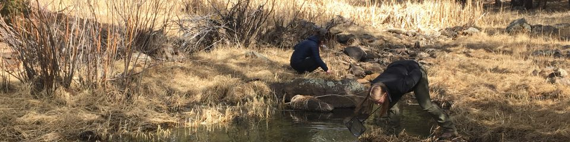

---
title: "Alumni | NAU School of Earth and Sustainability"
summary: "Connect with our accomplished graduates working in environmental consulting, government agencies, academia, and leading sustainability initiatives worldwide. Alumni success stories and career outcomes."
type: landing

sections:
  - block: hero
    content:
      title: "SES Alumni"
      text: |
        ## Connecting Our Community
        
        Stay connected with your NAU colleagues and current students in SES programs. Our alumni apply their skills to address problems in a range of sectors including industry, government, education, and non-profit organizations.
      image:
        filename: alumni-graduation.jpg
    design:
      background:
        gradient_start: 'rgba(0, 52, 102, 0.7)'
        gradient_end: 'rgba(0, 52, 102, 0.5)'
        text_color_light: true

  - block: markdown
    content:
      title: "Our Alumni Community"
      text: |
        The School of Earth and Sustainability has graduated hundreds of students who have gone on to successful careers across diverse sectors. Our alumni are making significant contributions to scientific research, environmental policy, education, consulting, and public service around the world.
        
        

          

            

              

                

                  <i class="fas fa-industry fa-3x text-primary"></i>
                

                <h5 class="card-title">Industry</h5>
                
Environmental consulting, mining, energy, water resources, and technology sectors

              

            

          

          

            

              

                

                  <i class="fas fa-landmark fa-3x text-primary"></i>
                

                <h5 class="card-title">Government</h5>
                
Federal and state agencies, natural resource management, environmental protection

              

            

          

          

            

              

                

                  <i class="fas fa-graduation-cap fa-3x text-primary"></i>
                

                <h5 class="card-title">Education</h5>
                
Teaching and research positions at universities, community colleges, and K-12 schools

              

            

          

        

        
        

          

            

              

                

                  <i class="fas fa-heart fa-3x text-primary"></i>
                

                <h5 class="card-title">Non-Profit Organizations</h5>
                
Conservation organizations, environmental advocacy, community development

              

            

          

          

            

              

                

                  <i class="fas fa-microscope fa-3x text-primary"></i>
                

                <h5 class="card-title">Research & Academia</h5>
                
Research institutions, national laboratories, graduate programs

              

            

          

        

  - block: markdown
    content:
      title: "Alumni by Program"
      text: |
        Our graduates represent diverse academic backgrounds within Earth and sustainability sciences:
        
        ### Geology Alumni
        Our geology graduates work in diverse fields including:
        - Environmental consulting and remediation
        - Natural resource exploration and extraction
        - Hydrogeology and groundwater management
        - Geotechnical engineering support
        - Government agency research and monitoring
        - Academic research and teaching
        
        ### Environmental Sciences and Sustainability Studies Alumni
        Environmental Sciences and Sustainability Studies graduates pursue careers in:
        - Environmental impact assessment and mitigation
        - Sustainability consulting and green business
        - Climate change adaptation and mitigation
        - Environmental education and outreach
        - Policy analysis and development
        - Conservation and natural resource management
        
        ### Climate Science and Solutions Alumni
        Our Climate Science and Solutions program graduates are working on:
        - Climate data analysis and modeling
        - Climate risk assessment for businesses and communities
        - Renewable energy project development
        - Climate policy implementation
        - Carbon accounting and emissions management
        - Climate adaptation planning

  - block: markdown
    content:
      title: "Field Experiences and Connections"
      text: |
        

          

            
One of the hallmarks of SES education is our commitment to field-based learning. Our alumni often reflect on transformative field experiences that shaped their careers and built lasting professional networks. 
Field experiences like summer research trips, capstone projects, and collaborative research with faculty provide students with hands-on skills and real-world applications of their classroom learning. These experiences often lead to job opportunities, graduate school connections, and lifelong professional relationships.
 
<em>"The field experiences in SES didn't just teach me technical skills - they showed me how to work as part of a team, think critically about complex environmental problems, and communicate science to diverse audiences."*</em>
<em><strong>— SES Alumni Reflection</em></strong>

          

          
          

            
            
SES alumni, graduate students, and faculty exploring field sites during summer research experiences.

          

        

  - block: markdown
    content:
      title: "Stay Connected"
      text: |
        

          

            

              <h4>🤝 Join Our Alumni Network</h4>
              
We encourage all SES alumni to stay connected with the school and with each other. Whether you're looking to:

              <ul>
                <li>Mentor current students</li>
                <li>Share job opportunities</li>
                <li>Collaborate on research projects</li>
                <li>Attend alumni events</li>
                <li>Support current students and programs</li>
              </ul>
              
We want to hear from you!

            

          

        

        
        ### Update Your Information
        Help us keep our alumni database current by updating your contact information and career details. This helps us:
        - Connect you with other alumni in your field
        - Share relevant job opportunities
        - Invite you to networking events and guest lectures
        - Showcase alumni success stories
        
        ### Social Media and Online Presence
        Connect with SES and fellow alumni through our social media channels:
        - **Facebook**: Stay updated on school news and alumni achievements
        - **LinkedIn**: Professional networking and career opportunities
        - **Instagram**: Behind-the-scenes looks at current research and student life
        - **YouTube**: Research presentations and field experience videos

  - block: markdown
    content:
      title: "Contact Us"
      text: |
        

          

            <h5>School of Earth and Sustainability</h5>
            

              <strong>Email:</strong> SES.Admin@nau.edu 
              <strong>Phone:</strong> 928-523-9333 
              <strong>Address:</strong> 
              Room A108, Building 11, Ashurst 
              624 S Knoles Dr 
              Flagstaff, AZ 86011
            

          

          

            <h5>Alumni Services</h5>
            
For alumni-specific inquiries including:

            <ul>
              <li>Updating your contact information</li>
              <li>Sharing career updates and achievements</li>
              <li>Volunteering opportunities</li>
              <li>Mentorship programs</li>
              <li>Event planning and participation</li>
            </ul>
            
Please reach out to our administrative team.

          

        

        
        

          <a href="/contact/" class="btn btn-primary">Contact SES</a>
        

---