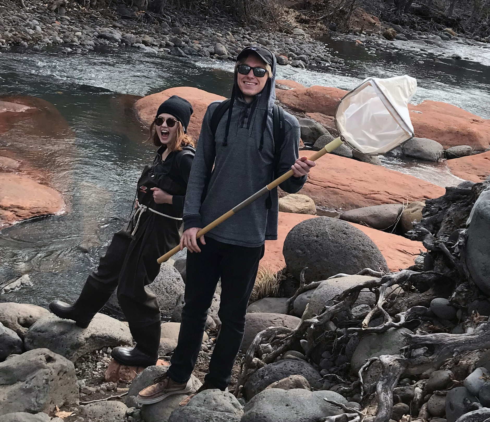
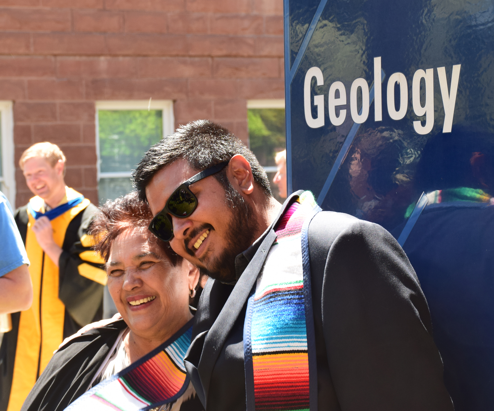
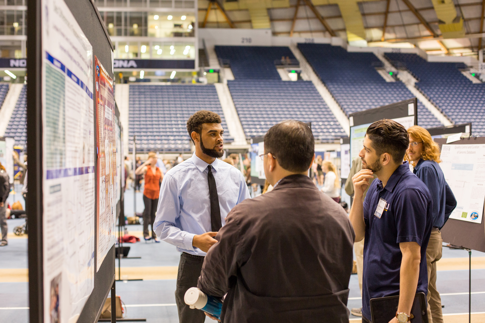

---
title: "Student Opportunities | NAU Earth Sciences & Sustainability Programs"
summary: "Undergraduate and graduate degrees in geology, environmental science, climate science, and sustainability at NAU. Research opportunities, certificates, and career preparation programs."
date: 2025-08-19
type: landing

sections:
- block: hero
  content:
    title: |
      Student Opportunities
    text: |
       
      The School of Earth and Sustainability offers comprehensive degree and certificate programs designed to prepare students for careers in environmental science, geology, sustainability, and earth sciences. From undergraduate to doctoral programs, discover your path to making a meaningful impact on our planet's future.
    image:
      filename: laboratory-work.jpg
- block: markdown
  content:
    title: "Explore Our Degrees"
    text: |
      Our degree programs provide hands-on learning experiences and prepare students for successful careers in environmental sciences, geology, and sustainability. From undergraduate foundations to advanced graduate research, find the program that matches your goals.
      
      

        

          
          <h4>Undergraduate Programs</h4>
          <ul>
            <li><strong>Geology BS</strong> - 120 units with field and lab experiences</li>
            <li><strong>Environmental Sciences BS</strong> - Interdisciplinary with multiple emphasis areas</li>
            <li><strong>Environmental and Sustainability Studies BA/BS</strong> - Natural sciences integrated with social sciences</li>
            <li><strong>Earth Science BSED</strong> - Teaching certification for grades 6-12</li>
          </ul>
          
<a href="undergraduate-degrees/" class="btn btn-primary">Learn More About Undergraduate Programs</a>

        

        

          
          <h4>Graduate Programs</h4>
          <ul>
            <li><strong>Geology MS</strong> - Research-focused with multiple specialization areas</li>
            <li><strong>Environmental Sciences and Policy MS</strong> - Two-year interdisciplinary program</li>
            <li><strong>Climate Science and Solutions MS</strong> - Professional 18-month program</li>
            <li><strong>Earth Sciences and Environmental Sustainability PhD</strong> - Doctoral research program</li>
          </ul>
          
<a href="graduate-degrees/" class="btn btn-primary">Learn More About Graduate Programs</a>

        

      

  design:
    columns: 1
- block: markdown
  content:
    title: "Explore Our Certificate Programs"
    text: |
      Certificate programs provide specialized training for career advancement and skill development in high-demand areas. Choose from professional certificates, graduate certificates, or undergraduate certificates that complement your career goals.
      
      

        

          
          <h4>Professional Certificate in Greenhouse Gas Accounting</h4>
          
Online certificate program designed for working professionals.

          <ul>
            <li><Online, Self-Paced</strong> - Online, not-for-credit</li>
            <li>Start at any time</li>
          </ul>
          
<a href="professional-certificates/" class="btn btn-primary">Learn More About this Professional Certificate</a>

        

        

          
          <h4>Graduate Certificate in Greenhouse Gas Accounting</h4>
          
Advanced skills-based certificate designed for graduate students seeking specialized expertise to complement their graduate studies.

          <ul>
            <li>Online certificate designed for graduate students</li>
            <li>12 credits; complete in 1 year</li>
          </ul>
          
<a href="graduate-certificates/" class="btn btn-primary">Learn More About this Graduate Certificate</a>

        

        

          
          <h4>Undergraduate Certificate in Greenhouse Gas Management and Mitigation</h4>
          
Specialized undergraduate skills-based training to make you 100% career-ready.

          <ul>
            <li>Sustainability & climate action</li>
            <li>18-credits</li>
          </ul>
          
<a href="undergraduate-certificates/" class="btn btn-primary">Learn More About this Undergraduate Certificate</a>

        

      

  design:
    columns: 1
- block: markdown
  content:
    title: "Why Choose SES?"
    text: |
      ### Hands-On Learning
      - Field experiences and laboratory work
      - Real-world research projects
      - Professional internship opportunities
      
      ### Expert Faculty
      - World-renowned researchers and educators
      - Personalized mentoring and guidance
      - Collaborative research opportunities
      
      ### Career Preparation
      - Strong industry and agency partnerships
      - High employment rates for graduates
      - Professional certification opportunities
      
      ### Financial Support
      - Research and teaching assistantships available
      - Wyss Scholars program for graduate students
      - Federal financial aid for certificate programs
      
      ### Contact Information
      
      **Email:** SES.Admin@nau.edu  
      **Phone:** 928-523-9333  
      **Location:** Room A108, Building 11, Ashurst, NAU Flagstaff Campus
  design:
    columns: 1
---